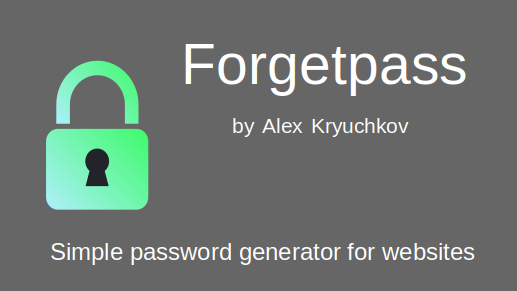
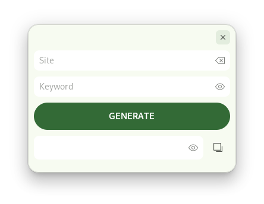

# Forgetpass

The application is created using the [Helium library](https://github.com/tau-OS/libhelium).
Based on the [Forgetpass app](https://github.com/alexkdeveloper/forgetpass).

It is recommended to use the GNOME Builder IDE to build the application.
